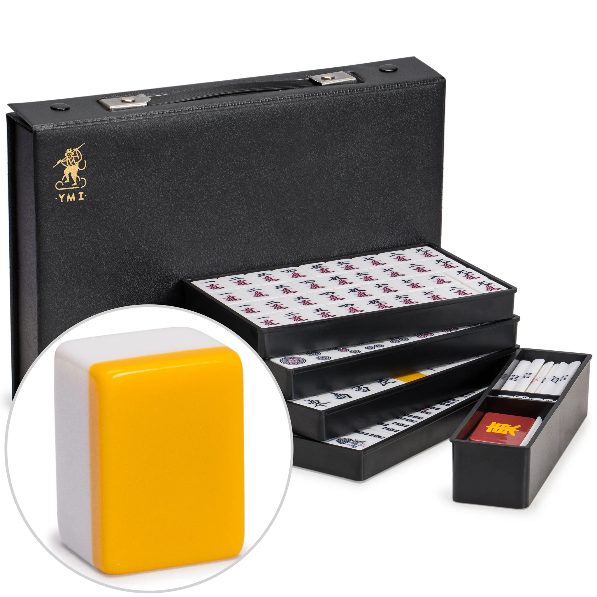
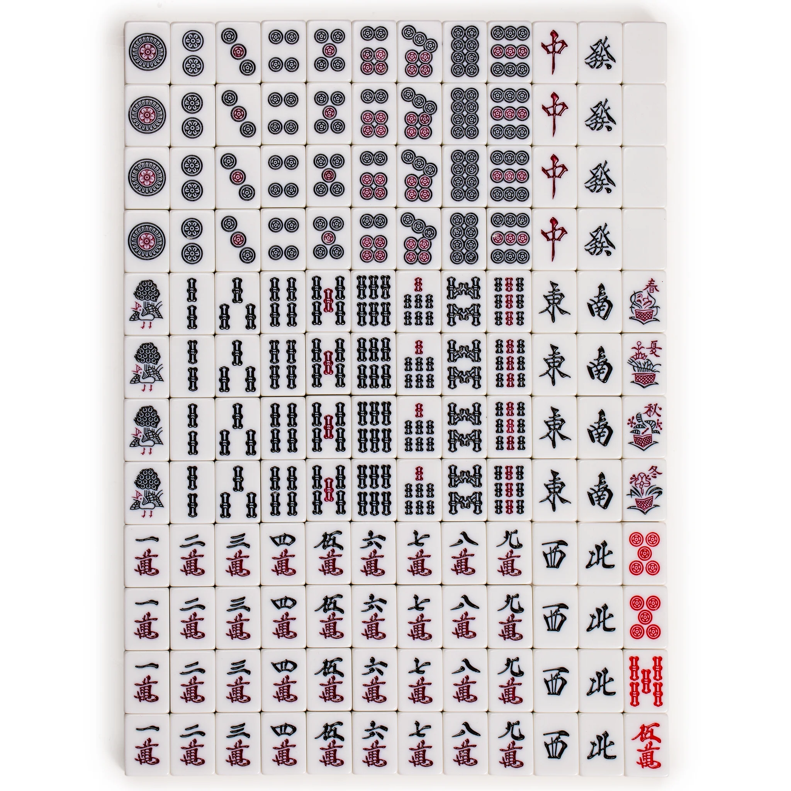

# 1.1 基本機制

立直麻雀是運氣成分極大、但通過數百場以上的對局數據又能高下立判的遊戲。本教程基於21世紀初、特別是網絡麻雀（<l-ja>ネット麻雀</l-ja>）興起後更加定型的日本麻雀一般規則。而以M-League（Ｍリーグ）為代表的競技麻雀規則與一般規則有諸多細節上的不同，會在講解中提及，但並不是本教程關注的重點。

日本麻雀的用語同遊戲本身一道由中國傳來，相關漢字詞讀音很像是來自北京官話。此外，不少術語有多個同義叫法，我雖然會儘量提及，也難免掛一漏萬，讀者在語料中遇到時莫要驚訝。

## 1.1.1 牌的種類

一般的日本麻雀有34種、每種4張共136張牌（パイ・ハイ）。中國南方常見的「花牌」（ファパイ・ハナハイ）雖會包含在市售的日本麻雀牌中，但一般規則不涉及。

  

    <ruby>{{ manzu.label }}<rt>{{ manzu.labelReading }}</rt>{{ manzu.type }}<rt>{{ manzu.typeReading }}</rt></ruby>：
  

  

    
{{ tile.rank }}{{ manzu.id }}

     
    

      <ruby>{{ tile.numeral }}<rt>{{ tile.reading }}</rt>{{ manzu.tileName }}<rt>{{ manzu.tileReading }}</rt></ruby>
    

  

「萬」一音「ワン」。麻雀語境中的「萬」用舊字體。

  

    <ruby>{{ pinzu.label }}<rt>{{ pinzu.labelReading }}</rt>{{ pinzu.type }}<rt>{{ pinzu.typeReading }}</rt></ruby>：
  

  

    
{{ tile.rank }}{{ pinzu.id }}

     
    

      <ruby>{{ tile.numeral }}<rt>{{ tile.reading }}</rt>{{ pinzu.tileName }}<rt>{{ pinzu.tileReading }}</rt></ruby>
    

  

寫作「筒」讀作「餅」，是的你沒看錯。中文又稱「餅子」。

  

    <ruby>{{ souzu.label }}<rt>{{ souzu.labelReading }}</rt>{{ souzu.type }}<rt>{{ souzu.typeReading }}</rt></ruby>：
  

  

    
{{ tile.rank }}{{ souzu.id }}

     
    

      <ruby>{{ tile.numeral }}<rt>{{ tile.reading }}</rt>{{ souzu.tileName }}<rt>{{ souzu.tileReading }}</rt></ruby>
    

  

各類資料無不將「三索」註音為「サンソー」，但我親耳聽到的明明都是「サンゾー」，十分奇妙，請留意。中文又稱「條子」。

以上27種統稱<strong>「數牌」</strong>（シュウパイ・スウパイ）。在當下最通行的日本麻雀規則中，五萬、五筒、五索各有一張會換成「<ruby>赤<rt>あか</rt>牌<rt>はい</rt></ruby>」，如下方圖片所示。也常會加一點以方便視障者（<m-pai>0m　0p　0s</m-pai>）。至於赤牌的功用，且聽下回分解。

此外還有7種 <strong>「字牌」</strong>（ツーパイ・ジハイ），如下。

  

    
{{ tile.tile }}

     
    

      <ruby>{{ tile.name }}<rt>{{ tile.reading }}</rt></ruby>
    

  

東、南、西、北統稱「風牌」（フォンパイ・カゼハイ），白、發、中統稱「三元牌」（サンゲンパイ），中文一般分別叫做東風、南風、西風、北風、白板、發財、紅中。日語資料中雖名義上有<l-ja><ruby>白<rt>パイ</rt>板<rt>パン</rt></ruby>、<ruby>緑<rt>リュー</rt>發<rt>ファ</rt></ruby>／<ruby>發<rt>ファー</rt>財<rt>ツァイ</rt></ruby>、<ruby>紅<rt>ホン</rt>中<rt>チュン</rt></ruby></l-ja>的全稱，但大概衹有「パイパン」還作為性隱語活躍在當下的語料中了w（日本麻雀的白板真的什麼都沒畫，中國麻雀則會框一個花邊。）

本博客的牌使用了[一點麻雀](https://github.com/SyaoranHinata/I.Mahjong)字體來渲染，沒有顏色。也請見識有顏色的真實麻雀牌[^1]：

[^1]: 來源：https://www.ymimports.com/products/yw-jm001-a

  
  

日本麻雀的綠色很深，有時跟黑色很像，實際上索子及<m-pai>6z</m-pai>中的深色都是綠，而餅子、萬子及風牌上的則是真的黑。

## 1.1.2 遊戲的進行

我們先從配牌已完成之後開始說起。配牌完成後，每位玩家會有13張手牌，隨後每位玩家會輪流從牌山（相當於卡牌的牌堆）摸一張牌，然後選擇一張手牌打出。

麻雀是四人遊戲（雖然在日本也流行三人麻雀，暫且不提），四人圍坐在方桌旁，**逆時針**輪流摸打。自己左邊叫做「<ruby>上<rt>カミ</rt>家<rt>チャ</rt></ruby>」，上家摸打玩就輪到自己，自己摸打完輪到右面的「<ruby>下<rt>シモ</rt>家<rt>チャ</rt></ruby>」，而對面則叫做<l-ja>「<ruby>対<rt>トイ</rt>面<rt>メン</rt></ruby>」</l-ja>（中文叫「對家」）。每一局有一人是「莊家」，日語通稱「<ruby>親<rt>おや</rt></ruby>」，其餘人則稱為「閑家」或「散家」，日語通稱「<ruby>子<rt>こ</rt></ruby>」。絕對方位上，莊家叫做「<ruby>東<rt>トン</rt>家<rt>チャ</rt></ruby>」，其下家叫做「<ruby>南<rt>ナン</rt>家<rt>チャ</rt></ruby>」，再下家叫做「<ruby>西家<rt>シャーチャ</rt></ruby>」，再下家叫做「<ruby>北<rt>ペー</rt>家<rt>チャ</rt></ruby>」，所以是「上北下南左東右西」。每一局結束後，和牌（後述）的如果是莊家就連莊（<l-ja><ruby>連荘<rt>レンチャン</rt></ruby></l-ja>），否則過莊（<l-ja><ruby>輪荘<rt>ロンチャン</rt></ruby>・<ruby>輪荘<rt>リンチャン</rt></ruby></l-ja>）給下家。

